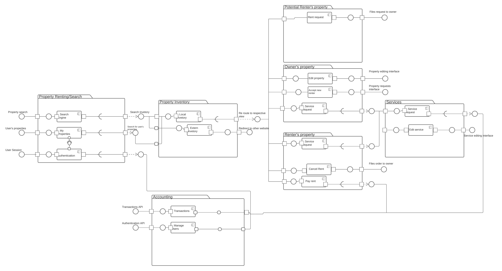
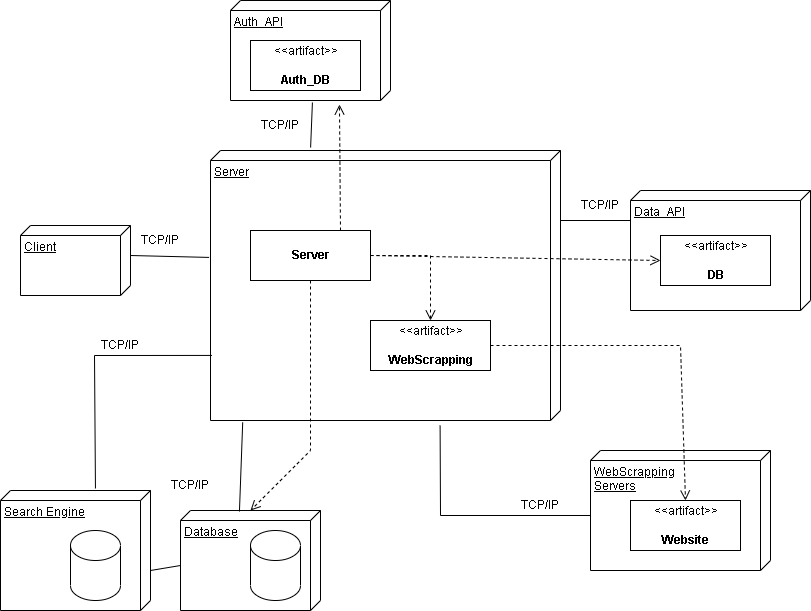

# Development

## Architecture and design

Describe the architecture and design of the system. Use component/deployment diagrams. If needed, resort to package diagrams to organize them into more manageable parts.

Be clear about what is the current architecture/design and what is the one you envision in the future, in case they are different.
Identify main risks and justify the most important choices to show the soundness of the architecture and design that you have implemented or plan to implement.

## Technology

The platform will be developed using the MERN stack, which includes the following technologies:

- **M**ongoDB (database tier): MongoDB is a NoSQL database where each record is a document comprising key-value pairs that are similar to JSON.
- **E**xpress (server tier): Rather than writing the code using Node.js and creating loads of Node modules, Express makes it simpler and easier to write the back-end code
- **R**eact.js (front end): React is a JavaScript library that is used for building user interfaces
- **N**ode (server tier): Node.js provides a JavaScript Environment which allows the user to run their code on the server.

For the search catalog, Elasticsearch was the chosen search engine.

Of the technologies mentioned above, only React and a document-based database were given preference by the client.

The rest of the tecnlogies were choosen through a poll done by the developers.

Other technlogy choices include:

- JavaScript as the main programming language.
- Visual Studio Code as the preferred IDE by the developers.
- Python as the chosen programming language for the web-scraping.

### Base Implementation

The prototype implemented on Sprint 0 is the final result of [this tutorial](https://www.mongodb.com/languages/express-mongodb-rest-api-tutorial) that details how to connect a MongoDB datasase to a React front-end using a Express Web REST API middle-end.

## Development guide

Explain what a new developer to the project should know in order to develop the system, including who to build, run and test it in a development environment.

Document any APIs, formats and protocols needed for development (but don't forget that public APIs should also be accessible from the "How to use" section in your README.md file).

Describe coding conventions and other guidelines adopted by the project.

## Risk Identification

- Server crash → Using our MongoDB database we can assure persistence in the information so that if our server crashes we can always get the app back running again from the state it previously was.
- Cross-platform compatibility → Choosing React as our front-end library ensures compatibility with all modern browsers in their respectively mobile or desktop versions. It also future-proofs us for mobile app development if we choose to do so as React has strong links to React Native.
- Inaccurate project estimating → By using agile methods we expect to always have a product to deliver. Even if we don't have the complete product we will always have a functional release at the end of every development sprint.

## Security concerns

Identify potential security vulnerabilities classes and explain what the team has done to mitigate them.

## Quality assurance

Describe which tools are used for quality assurance and link to relevant resources. Namely, provide access to reports for coverage and mutation analysis, static analysis, and other tools that may be used for QA.

## Metrics

- [Team 1](https://github.com/FEUP-MEIC-DS-2022-1MEIC06/DS/blob/main/docs/scrum/metrics/team1.md)

- [Team 2](./scrum/metrics/team2.md)

- [Team 3](https://github.com/FEUP-MEIC-DS-2022-1MEIC06/DS/blob/main/docs/scrum/metrics/team3.md)

- [Team 4](https://github.com/FEUP-MEIC-DS-2022-1MEIC06/DS/blob/main/docs/scrum/metrics/team4.md)

## Component diagram

## Deployment diagram

This is the deployment diagram of our project.
To clarify some of the specifics:

- On the server, we run a script, represented by the artifact "WebScrapping" which browses throught some websites, which we can't use an API to obtain its data (WebScrapping_Servers node);
- Our server depends on Auth API's like Instagram API to allow ssome users to login/register (Auth_DB node)
- Our server is connected to a document based database, in this case, MongoDB (Database node) and this server is connected to a search engine, in this case, or Elastik (which, being a distributed system, can be scaled horizontally if needed) from where our server retrieves data (Search Engine node).

## Retrospectives

- [Team 1](https://github.com/FEUP-MEIC-DS-2022-1MEIC06/DS/blob/main/docs/scrum/retrospectives/team1.md)

- [Team 2](./scrum/retrospectives/team2.md)

- [Team 3](../docs/scrum/retrospectives/team3.md)

- [Team 4](./scrum/retrospectives/team4.md)

- [Group (All teams)](./scrum/retrospectives/teams.md)
