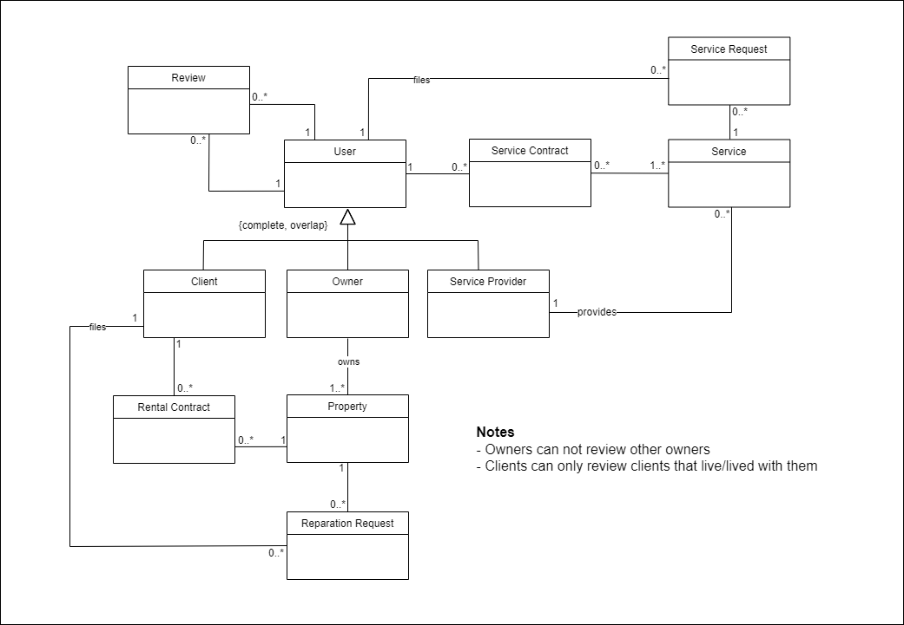

# Product Management

## Product Vision

HotSquare is a microsite that facilitates communication between landlords, tenants, and service providers. Directed at students, digital nomads, and everyone who might need to rent accommodation, HotSquare aims to solve the emerging lack of solutions for these people. Listing advertisements from various sources, its smart and user-customized search methods allow for seamless use of the app granting the construction of a valuable database of possible future house buyers.

## Market Research

Survey of similar projects and analysis of their pros and cons when compared to the product to be developed. 

### Intelligent Search

Currently there is no platform that allows all the intelligent search options that we want to use. However, there are some websites which have some of these implemented.

Idealista is a website that allows user to draw in the map the area that they want to search for. The area is 100% adaptable to cater towards what the user wants, allowing, for an example, to draw around a couple streets instead of a city/area.

Another website that uses a map to help the user is student.alfredo. This website presents a colored map which is divided by the medium price of rents in that area (green for cheaper areas and red for more expensive ones). This allows the user to compare in a map the area that be wants to stay with the value that he will be expected to pay.

Lastly, the most important one is spotahome. It allows the user to do an intelligent search, just not as deep as we inteded. It allows the user to search specefici topics, such as animal accepting places, student oriented, short/long stay and with a verification tab (the verification of a house allows the user to be sure that they won't get scammed like in other websites).

### Services

After research in some websites, we noticed that there are few relationship on real estate with common services. The main focus of these websites is to provide to the costumer the housing they need, based on quality, location, distance to points of interest and price. There are no functionalities that gives the costumer options of services they need on a daily life in their homes.

Rent for me is the only website we found that does that, not in an automatic manner, but in a way that the company needs labor to find those services and contact them.
That website gives the costumer the following services: house hunting, shipping/storage, room packing, cleaning services, utility services and property managment.

Our aim is to make the connections in some of these services with the costumer automatically.

### Filtering 

The Remax site, among all observed, is the one with the greatest variety in its filters. Nonetheless, with some filters existing on sites other than Remax, we would be able to obtain and help to restrict even more choices for any type of person to find the right housing.

The first step to be observed is whether we want to rent or buy a house.

Then, choose the location that interests us, by: Country, District, County, Parish

After that, we have the option to choose the type of property. Within this, we have two types of property:
-housing, such as, apt, studio, townhouse, student residence, building, land, garage, duplex, farmhouse
-commercial, such as warehouse, hotel, investments, office, industrial, store, homestead

It is also important to have different options, where important or necessary proximities are inserted, such as, restaurants, active life, arts, entertainment, public transport, etc.
Then it can be inserted at a distance to these locations by foot, car, bus, etc.

You will also need a price range.

After choosing what we want (buy or rent), location, and type of housing/commercial, we have several filters (with a yes/no answer or by options) to restrict the type of ads that appear.

Between choosing the number of rooms you want, energy certification, number of bathrooms (private bathroom?), area in m2, parking (individual box, number of spaces), house features (air conditioning, renewable energy, countryside, balcony, storage room, equipped kitchen, garden, beach, backyard, terrace, urban, exterior views), market status (any, good condition, new, for works, reasonable, used), property category (any, agricultural, short-term rental, exchanges, gated, state, vacation, industrial, investment, leisure, private property, rest, land, transfer), charging for electric cars, virtual tour, sales method (value per month,
from, price), price on request, discount, and, in the case of an apt, whether it has an elevator.

In the case of leasing, we may have a few more filters. Check-in date, length of stay, bills included, compatibility (perfect for couples, for students, pet)

After this more extensive filtering, we should have a filter with the ascending/descending price of the ads, newer/older post, higher/lower price per m2, higher/lower floors, larger area.

## Domain Analysis

